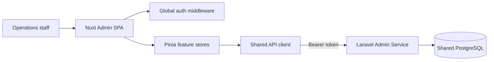
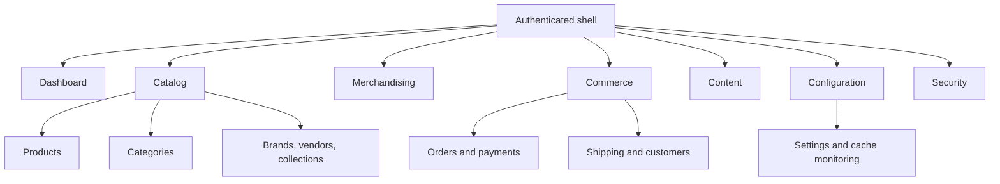

# Glamrush Admin architecture

## Purpose

Glamrush Admin is a client-side operations application. It renders the staff experience and delegates authentication, authorization, validation, persistence, and business rules to the Laravel Admin Service.



## Runtime model

`ssr: false` makes the application a browser-rendered SPA. Nuxt still supplies file-based routing, auto-imports, runtime configuration, layouts, and build tooling. The public `API_BASE` runtime value selects the Admin Service.

The application is not a trusted security boundary. All permissions, validation, and ownership constraints must be enforced by the Admin Service.

## Request flow

```text
Page/component -> Pinia feature store -> useApiClient -> Admin API
               <- reactive state      <- normalized response/error
```

- `app/composables/apiClient.js` constructs requests, attaches bearer authentication, parses JSON errors, handles unauthorized responses, supports multipart requests, and downloads CSV exports.
- `app/constants` centralizes endpoint paths and feature constants.
- `app/stores` holds server state and feature actions.
- `app/pages` maps URLs to operational screens.
- `app/components` contains reusable forms, tables, charts, dialogs, and feature controls.

## Authentication and routing

The auth store persists `auth_token` in a cookie and fetches the current staff user. `app/middleware/auth.global.js` distinguishes public password/authentication pages from protected routes, hydrates user state after refresh, and redirects invalid sessions.

Authorization is two-layered:

1. The UI uses permission data to hide or disable unavailable actions.
2. The Admin Service permission middleware remains authoritative.

Never infer API authorization solely from whether a navigation item is visible.

## State management

There is one Pinia store per business capability, including catalog entities, content, discounts, orders, shipping, settings, analytics, cache monitoring, newsletter subscribers, access control, and authentication.

Stores should expose:

- Reactive data, loading, and error state
- Fetch/list/detail actions
- Create/update/delete or lifecycle actions supported by the API
- State normalization needed by more than one component

Temporary view state that does not cross component boundaries can remain local to a component.

## UI system

PrimeVue provides the base component library and Aura theme. Tailwind CSS handles layout and project-specific styling. PrimeIcons are the standard icon set. Forms should use PrimeVue Forms with Yup validation.

Reusable components should handle consistent:

- Loading and skeleton states
- Empty and error states
- Confirmation for destructive actions
- Validation summaries and field errors
- Pagination and filter persistence
- Permission-denied states
- Responsive layouts

## Feature boundaries



Cross-feature behavior should live in a shared composable or component only when it is genuinely generic. Avoid stores importing UI concerns or pages performing raw HTTP requests.

## Error handling

The API client throws `ApiError` with status, message, and validation errors. Feature code should translate that into a user-facing toast or inline state while preserving field-level validation. A `401` clears authentication globally. `403`, `404`, `409`, `422`, and `429` should remain distinguishable in feature screens.

## Deployment

The compiled Nuxt output is static client application output and can be hosted on Cloudflare Pages or another static/CDN platform. Configure:

- `API_BASE` during build/runtime as supported by the host
- Admin Service CORS for the exact production origin
- HTTPS on both origins
- SPA fallback routing to the generated entry point
- Cache policies that allow immutable assets but do not cache authenticated API responses

After deployment, smoke-test login, permission hydration, a read workflow, a multipart media workflow, and logout.

## Testing direction

There is currently no automated test command. Recommended additions are:

- Vitest for stores, composables, and permission behavior
- Nuxt Test Utils for component/page integration
- Playwright for login, catalog editing, order operations, and role restrictions
- Contract tests against a versioned Admin API schema
